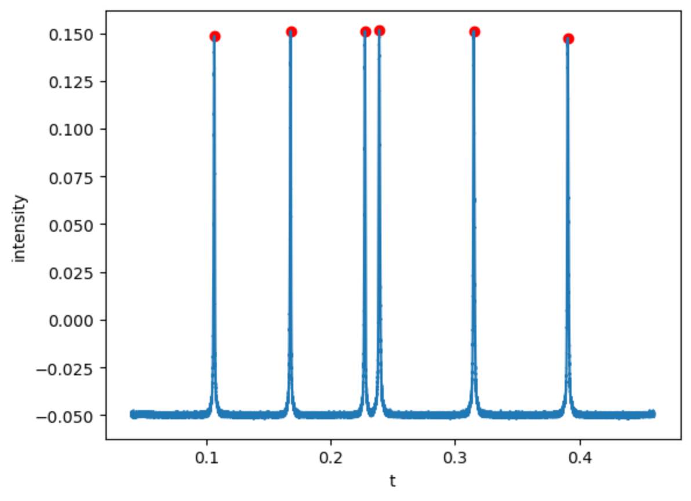
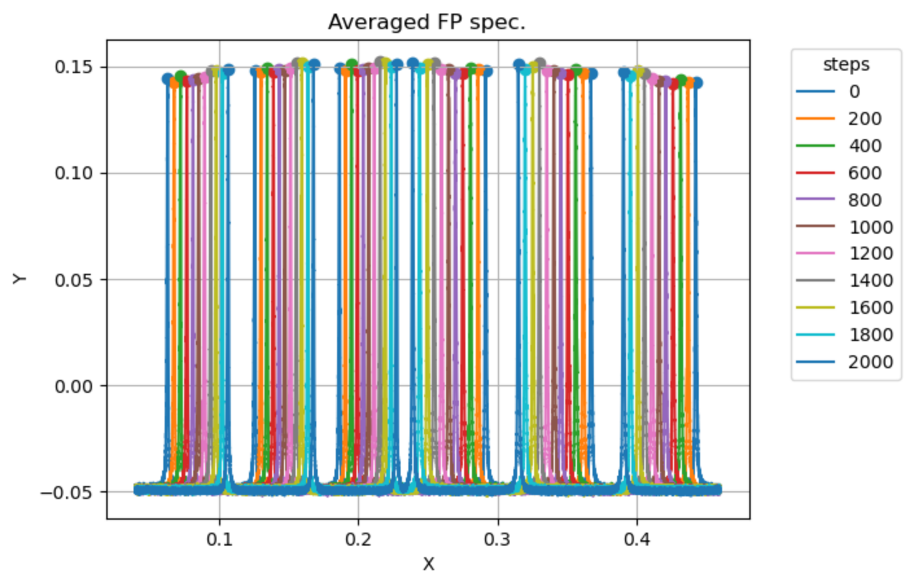
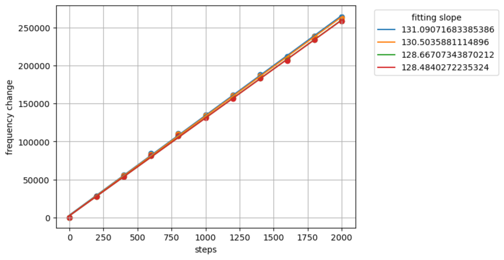

*Author: Xinyu Feng*

# Math derivation

## Estimation of the PZT response

The frequency of the laser is controlled by the PZT, but the PZT is not a linear instrument, so the output frequency can be written as the function of the voltage applied on it.

$$
f = F(V)
$$

For an F-P cavity, the resonant peaks are noted as $f_{0m}$, where $m$ represents the order of the peak.  
So when scanning the PZT voltage using a triangular wave, we can see a series of peaks with a symmetric axis at the center.

The position of each peak satisfies

$$
f_{0m} = F(V_{0m})
$$

We can use the peak positions and FSR to estimate the function \( F \).

Then we can move the stepper motors, and the peaks will move correspondingly.  
For each stepper motor position, we can obtain an estimation of \( F \), and then average them.

**\( F \) can be linear or quadratic depending on the required accuracy.**

---

## Estimate the frequency change

After obtaining \( F \), set step = 0 as the starting point.  
Calculate the frequency changes with respect to this reference based on \( F \).

---

## Calculate the frequency change per step

After computing the frequency changes, perform a linear fit with respect to step number and average the slopes.

**The slope is the calibration factor.**

